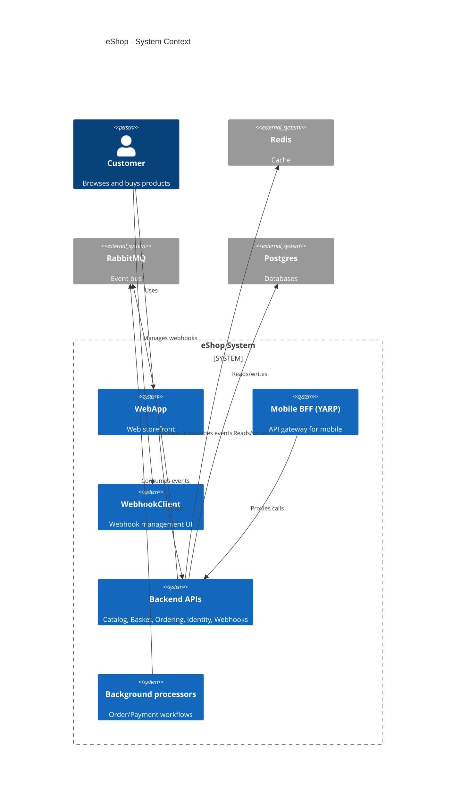
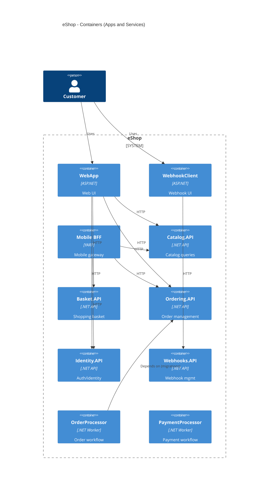
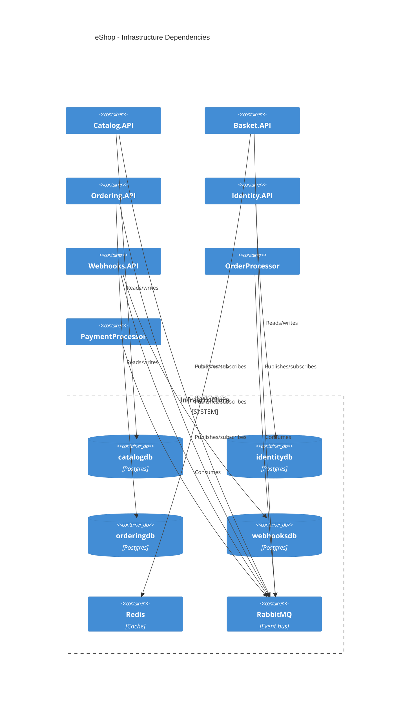

# Architecture

## System context

```mermaid
C4Context
title eShop - System Context
Person(customer, "Customer", "Browses and buys products")

System_Boundary(eshop, "eShop System") {
  System(webapp, "WebApp", "Web storefront")
  System(mobilebff, "Mobile BFF (YARP)", "API gateway for mobile")
  System(webhooksclient, "WebhookClient", "Webhook management UI")
  System(apis, "Backend APIs", "Catalog, Basket, Ordering, Identity, Webhooks")
  System(workers, "Background processors", "Order/Payment workflows")
}

System_Ext(redis, "Redis", "Cache")
System_Ext(rabbit, "RabbitMQ", "Event bus")
System_Ext(postgres, "Postgres", "Databases")

Rel(customer, webapp, "Uses")
Rel(customer, webhooksclient, "Manages webhooks")
Rel(mobilebff, apis, "Proxies calls")
Rel(webapp, apis, "Calls")
Rel(apis, rabbit, "Publishes/subscribes events")
Rel(workers, rabbit, "Consumes events")
Rel(apis, postgres, "Reads/writes")
Rel(apis, redis, "Reads/writes")
```

## Containers

```mermaid
C4Container
title eShop - Containers (Apps and Services)
Person(customer, "Customer")

System_Boundary(eshop, "eShop") {
  Container(webapp, "WebApp", "ASP.NET", "Web UI")
  Container(webhooksclient, "WebhookClient", "ASP.NET", "Webhook UI")
  Container(mobilebff, "Mobile BFF", "YARP", "Mobile gateway")

  Container(catalogapi, "Catalog.API", ".NET API", "Catalog queries")
  Container(basketapi, "Basket.API", ".NET API", "Shopping basket")
  Container(orderingapi, "Ordering.API", ".NET API", "Order management")
  Container(identityapi, "Identity.API", ".NET API", "Auth/identity")
  Container(webhooksapi, "Webhooks.API", ".NET API", "Webhook mgmt")

  Container(orderprocessor, "OrderProcessor", ".NET Worker", "Order workflow")
  Container(paymentprocessor, "PaymentProcessor", ".NET Worker", "Payment workflow")
}

Rel(customer, webapp, "Uses")
Rel(customer, webhooksclient, "Uses")
Rel(webapp, catalogapi, "HTTP")
Rel(webapp, basketapi, "HTTP")
Rel(webapp, orderingapi, "HTTP")
Rel(webapp, identityapi, "HTTP")
Rel(webhooksclient, webhooksapi, "HTTP")
Rel(mobilebff, catalogapi, "HTTP")
Rel(mobilebff, orderingapi, "HTTP")
Rel(mobilebff, identityapi, "HTTP")
Rel(orderprocessor, orderingapi, "Depends on (migrations)")
```

## Infrastructure dependencies

```mermaid
C4Container
title eShop - Infrastructure Dependencies
System_Boundary(infra, "Infrastructure") {
  ContainerDb(catalogdb, "catalogdb", "Postgres")
  ContainerDb(identitydb, "identitydb", "Postgres")
  ContainerDb(orderingdb, "orderingdb", "Postgres")
  ContainerDb(webhooksdb, "webhooksdb", "Postgres")
  Container(redis, "Redis", "Cache")
  Container(rabbit, "RabbitMQ", "Event bus")
}

Container(catalogapi, "Catalog.API")
Container(basketapi, "Basket.API")
Container(orderingapi, "Ordering.API")
Container(identityapi, "Identity.API")
Container(webhooksapi, "Webhooks.API")
Container(orderprocessor, "OrderProcessor")
Container(paymentprocessor, "PaymentProcessor")

Rel(catalogapi, catalogdb, "Reads/writes")
Rel(identityapi, identitydb, "Reads/writes")
Rel(orderingapi, orderingdb, "Reads/writes")
Rel(webhooksapi, webhooksdb, "Reads/writes")
Rel(basketapi, redis, "Reads/writes")
Rel(catalogapi, rabbit, "Publishes/subscribes")
Rel(basketapi, rabbit, "Publishes/subscribes")
Rel(orderingapi, rabbit, "Publishes/subscribes")
Rel(webhooksapi, rabbit, "Publishes/subscribes")
Rel(orderprocessor, rabbit, "Consumes")
Rel(paymentprocessor, rabbit, "Consumes")
```
